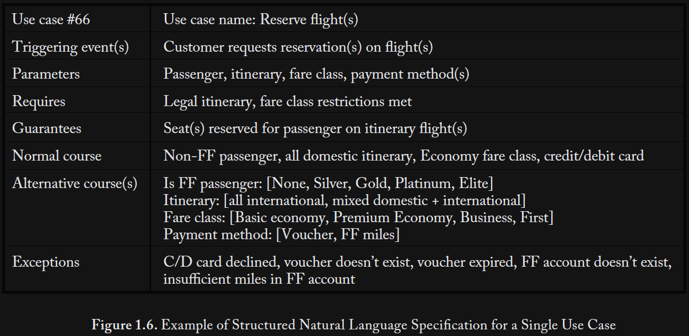

Washizaki, H. (Ed.). (2025). SWEBOK: Guide to the software engineering body of knowledge (Version 4.0a). IEEE Computer Society. https://computer.org/swebok

<small>\* The notes focus on practical advice not glossary terms.</small>

# 1 Software Requirements

## I

> If not detected and repaired early, missing, misinterpreted and incorrect requirements can induce exponentially cascading rework to correct them ... the project, the product or both are likely to suffer from added costs, delays, cancellations and defects.<small>[merged quotes]</small>

> The role of requirements documentation throughout the service life of the software is to capture and communicate intent for software engineers who maintain the code but might not have been its original authors.

## 1.4

> Functional requirements specify observable behaviors that the software is to provide — policies to be enforced and processes to be carried out.

## 1.5

> Nonfunctional requirements ... constrain the technologies to be used in the implementation ...

## 2.1

> Many projects benefit from performing a stakeholder analysis to identify as many important stakeholder classes as possible. This reduces the possibility that the requirements are biased toward better-represented stake holders and away from less well-represented stakeholders.

## 2.2

> Elicitation is not a passive activity. Even if cooperative and articulate stakeholders are available, the software engineer must work hard to elicit the right information.

## 3.1

> Each requirement should:
>
> - be unambiguous (interpretable in only one way);
>
> - be testable (quantified), meaning that compliance or noncompliance can be clearly demonstrated;
>
> - be binding, meaning that clients are willing to pay for it and unwilling not to have it;
>
> - atomic, represent a single decision
>
> - represent true, actual stakeholder needs;
>
> - use stakeholder vocabulary;
>
> - be acceptable to all stakeholders.

## 3.4

> When a project has more — and more diverse — stakeholders, conflicts among the requirements are more likely.
>
> ... project scope management ... balancing what’s desired in the stated software product requirements with what can be accomplished given the project requirements of cost, schedule, staffing and other project-level constraints.
>
> ... product family development (e.g., [20]). This involves separating requirements into two categories ... invariant requirements ... that all stakeholders agree on ... variant requirements, where conflict exists ... The software can be designed using design to invariants to accommodate the invariant requirements and design for change to incorporate customization points to configure an instance of the system ...

## 4.2

> Use case: 

> ... user story ... “As a \<role\> I want \<capability\> so that \<benefit\> ...

## 4.3

> [Test case:] ... “Given \<some context\> [and \<possibly more context\>], when \<stimulus\> then \<outcome\> [and \<possibly more outcomes\>].”

## 4.5

> ... documenting additional attributes for some or all requirements can be useful.
>
> - tag to support requirements tracing;
>
> - description (additional details about the requirement);
>
> - rationale (why the requirement is important);
>
> - source (role or name of the stakeholder who imposed this requirement);
>
> - use case or relevant triggering event;
>
> - type (classification or category of the requirement — e.g., functional, quality of service);
>
> - dependencies;
>
> - conflicts;
>
> - acceptance criteria;
>
> - priority (see Requirements Prioritization later in this KA);
>
> - stability (see Requirements Stability and Volatility later in this KA);
>
> - whether the requirement is common or a variant for product family development (e.g., [20]);
>
> - supporting materials;
>
> - the requirement’s change history.

## 5.3

> ... prototype that concretely demonstrates some important dimension of an implementation. Prototypes can help expose ... assumptions and, where needed, give useful feedback on why they are wrong.

## 6.2

> All stakeholders must understand and agree that accepting a change means accepting its impact on schedule, resources and/or commensurate change in scope elsewhere in the project.

## 7.2

> Prioritizing requirements is useful ... because it helps focus ... on delivering the most valuable functionality soonest.

> What factors are relevant in determining the priority of one requirement over another?” ...
>
> - value; desirability; client, customer and user satisfaction;
>
> - undesirability; client, customer and user dissatisfaction (Kano model, below);
>
> - cost to deliver;
>
> - cost to maintain over the software’s service life;
>
> - technical risk of implementation;
>
> - risk that users will not use it even if implemented.

> - enumerated scale (e.g., must have, should have, nice to have);

> Effective requirement prioritization focuses on finding groups of requirements with similar priorities rather than creating overly rigorous measurement scales or debating small differences.

# 2 Software Architecture

## 1.2

> ... concerns evolve over the life cycle of a system and as technologies, policies and other influences evolve.

## 1.3

> A principal use of a software system’s architecture is to give those working with it a shared understanding of the system to guide its design and construction.

## 2

> The architectural design stage addresses the fundamentals of the system as a whole and in relation to its environment ...

## 2.1

> An architecture view represents one or more aspects of an architecture to address one or more concerns [38*] ...
>
> - a logical view (depicts how the system will satisfy the functional requirements);
>
> - a process view (depicts how the system will use concurrency);
>
> - a physical view (depicts how the system is to be deployed and distributed) ...
>
> - a development view (depicts how the top-level design is broken down into implementation units, the dependencies among those units and how the implementation is to be constructed).

> Separating concerns by view allows interested stakeholders to focus on a few things at a time ...

## 2.3

> Architecture rationale captures why an architectural decision was made. This includes assumptions made before the decision, alternatives considered, and trade-offs or criteria used to select an approach and reject others. Recording rejected decisions and the reasons for their rejection can also be useful. In the future, this could either prevent a software project from making a poor decision — one rejected earlier for forgotten reasons — or allow the development to recognize that relevant conditions have changed and that they can revisit the decision.

## 3.2

> ... fundamentals of the system are decided, but other aspects, such as the internal details of major components are deferred.

> Typical concerns in architectural design ...
>
> - Overall architecture styles and computing paradigms
>
> - Large-scale refinement of the system into key components
>
> - Communication and interaction among components
>
> - Allocation of concerns and design responsibilities to components
>
> - Component interfaces
>
> - Understanding and analysis of scaling and performance properties, resource consumption properties, and reliability properties
>
> - Large-scale/system-wide approaches to dominating concerns (such as safety and security, where applicable)
