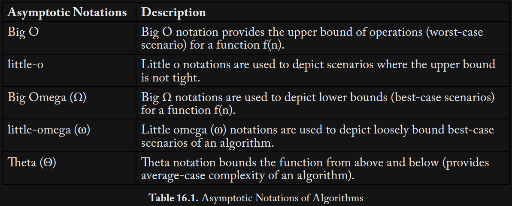
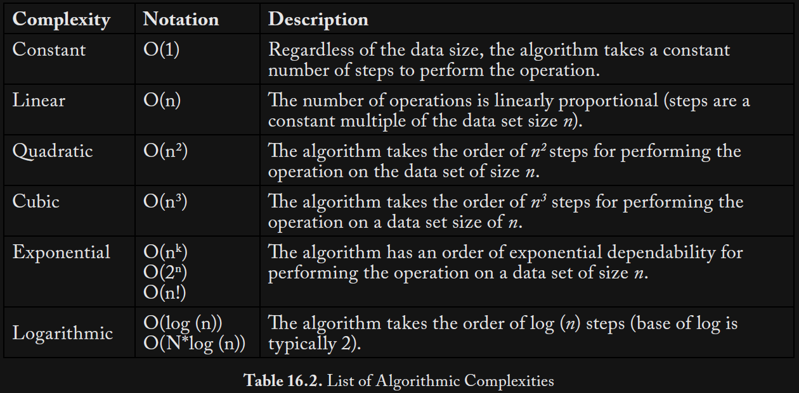

Washizaki, H. (Ed.). (2025). SWEBOK: Guide to the software engineering body of knowledge (Version 4.0a). IEEE Computer Society. https://computer.org/swebok

<small>\* The notes focus on practical advice not glossary terms.</small>

# 1 Software Requirements

## I

> If not detected and repaired early, missing, misinterpreted and incorrect requirements can induce exponentially cascading rework to correct them ... the project, the product or both are likely to suffer from added costs, delays, cancellations and defects.<small>[Merged quotes]</small>

> The role of requirements documentation throughout the service life of the software is to capture and communicate intent for software engineers who maintain the code but might not have been its original authors.

## 1.4

> Functional requirements specify observable behaviors that the software is to provide — policies to be enforced and processes to be carried out.

## 1.5

> Nonfunctional requirements ... constrain the technologies to be used in the implementation ...

## 2.1

> Many projects benefit from performing a stakeholder analysis to identify as many important stakeholder classes as possible. This reduces the possibility that the requirements are biased toward better-represented stake holders and away from less well-represented stakeholders.

## 2.2

> Elicitation is not a passive activity. Even if cooperative and articulate stakeholders are available, the software engineer must work hard to elicit the right information.

## 3.1

> Each requirement should:
>
> - be unambiguous (interpretable in only one way);
>
> - be testable (quantified), meaning that compliance or noncompliance can be clearly demonstrated;
>
> - be binding, meaning that clients are willing to pay for it and unwilling not to have it;
>
> - atomic, represent a single decision
>
> - represent true, actual stakeholder needs;
>
> - use stakeholder vocabulary;
>
> - be acceptable to all stakeholders.

## 3.4

> When a project has more — and more diverse — stakeholders, conflicts among the requirements are more likely.
>
> ... project scope management ... balancing what’s desired in the stated software product requirements with what can be accomplished given the project requirements of cost, schedule, staffing and other project-level constraints.
>
> ... product family development (e.g., [20]). This involves separating requirements into two categories ... invariant requirements ... that all stakeholders agree on ... variant requirements, where conflict exists ... The software can be designed using design to invariants to accommodate the invariant requirements and design for change to incorporate customization points to configure an instance of the system ...

## 4.2

> Use case: 

> ... user story ... “As a \<role\> I want \<capability\> so that \<benefit\> ...

## 4.3

> [Test case:] ... “Given \<some context\> [and \<possibly more context\>], when \<stimulus\> then \<outcome\> [and \<possibly more outcomes\>].”

## 4.5

> ... documenting additional attributes for some or all requirements can be useful.
>
> - tag to support requirements tracing;
>
> - description (additional details about the requirement);
>
> - rationale (why the requirement is important);
>
> - source (role or name of the stakeholder who imposed this requirement);
>
> - use case or relevant triggering event;
>
> - type (classification or category of the requirement — e.g., functional, quality of service);
>
> - dependencies;
>
> - conflicts;
>
> - acceptance criteria;
>
> - priority (see Requirements Prioritization later in this KA);
>
> - stability (see Requirements Stability and Volatility later in this KA);
>
> - whether the requirement is common or a variant for product family development (e.g., [20]);
>
> - supporting materials;
>
> - the requirement’s change history.

## 5.3

> ... prototype that concretely demonstrates some important dimension of an implementation. Prototypes can help expose ... assumptions and, where needed, give useful feedback on why they are wrong.

## 6.2

> All stakeholders must understand and agree that accepting a change means accepting its impact on schedule, resources and/or commensurate change in scope elsewhere in the project.

## 7.2

> Prioritizing requirements is useful ... because it helps focus ... on delivering the most valuable functionality soonest.

> What factors are relevant in determining the priority of one requirement over another?” ...
>
> - value; desirability; client, customer and user satisfaction;
>
> - undesirability; client, customer and user dissatisfaction (Kano model, below);
>
> - cost to deliver;
>
> - cost to maintain over the software’s service life;
>
> - technical risk of implementation;
>
> - risk that users will not use it even if implemented.

> - enumerated scale (e.g., must have, should have, nice to have);

> Effective requirement prioritization focuses on finding groups of requirements with similar priorities rather than creating overly rigorous measurement scales or debating small differences.

# 2 Software Architecture

## 1.2

> ... concerns evolve over the life cycle of a system and as technologies, policies and other influences evolve.

## 1.3

> A principal use of a software system’s architecture is to give those working with it a shared understanding of the system to guide its design and construction.

## 2.1

> An architecture view represents one or more aspects of an architecture to address one or more concerns [38*] ...
>
> - a logical view (depicts how the system will satisfy the functional requirements);
>
> - a process view (depicts how the system will use concurrency);
>
> - a physical view (depicts how the system is to be deployed and distributed) ...
>
> - a development view (depicts how the top-level design is broken down into implementation units, the dependencies among those units and how the implementation is to be constructed).

> Separating concerns by view allows interested stakeholders to focus on a few things at a time ...

## 3.2

> ... fundamentals of the system are decided, but other aspects, such as the internal details of major components are deferred.

> Typical concerns in architectural design ...
>
> - Overall architecture styles and computing paradigms
>
> - Large-scale refinement of the system into key components
>
> - Communication and interaction among components
>
> - Allocation of concerns and design responsibilities to components
>
> - Component interfaces
>
> - Understanding and analysis of scaling and performance properties, resource consumption properties, and reliability properties
>
> - Large-scale/system-wide approaches to dominating concerns (such as safety and security, where applicable)

# 3 Software Design

## 1.1

> ... design thinking appropriate to software: ...
>
> (1) crystallize a purpose or objective;
>
> (2) formulate a concept for how the purpose can be achieved;
>
> (3) devise a mechanism that implements the conceptual structure;
>
> (4) introduce a notation for expressing the capabilities of the mechanism and invoking its use;
>
> (5) describe the usage of the notation in a specific problem context to invoke the mechanism so the purpose is achieved. [20]

## 1.4

> Software design principles ...
>
> - Abstraction is “a view of an object that focuses on the information relevant to a particular purpose and ignores the remainder of the information” ...
>
> - Separation of concerns (SoC) ... By identifying and separating concerns, the designer can focus on each concern for the system in isolation ...
>
> - Modularization ... structures large software as comprising smaller components or units. Each component is named and has well-defined interfaces for its interactions with other components. Smaller components are easier to understand and, therefore, to maintain. ... each module in a system should have a single responsibility ...
>
> - Encapsulation ... nonessential information is less accessible, allowing users of the module to focus on the essential elements at the interface.
>
> - Separation of interface and implementation is an application of encapsulation that involves defining a component by specifying its public interfaces, which are known to and accessible to clients; isolating the use of a component from the details of how that component is built ...
>
> - Coupling is defined as “a measure of the interdependence among modules in a computer program” [11]. Most design methods advocate that modules should be loosely or weakly coupled.
>
> - Cohesion ... is defined as “a measure of the strength of association of the elements within a module” [11]. Cohesion highlights organizing a module’s constituents based on their relatedness. Most design methods advocate that modules should maximize their cohesion/locality.
>
> - Uniformity is a principle of consistency across software components — common solutions should be produced to address common or recurring problems. These include naming schemes, notations and syntax, interfaces that define access to services and mechanisms, and ordering of elements and parameters. This can be achieved through conventions such as rules, formats and styles.
>
> - Completeness ... means ensuring that a software component captures the important characteristics of an abstraction and leaves nothing out ... design completeness against requirements: a design should be sufficient for designers to demonstrate how requirements will be met and how subsequent work will satisfy those requirements ...
>
> - Verifiability means that information needed to verify the design against its requirements and other constraints is available ...

## 2

> Software design ... multistage ...
>
> - The architectural design stage addresses the fundamentals of the system as a whole and in relation to its environment ...
>
> - The high-level design stage is outward-facing — developing the top-level structure and organization of the software, identifying its various components and how that software system and its components interact with the environment and its elements.
>
> - The detailed design stage is inward-facing — specifying each component in sufficient detail to facilitate its construction and to meet its outside obligations, including how software components are further refined into modules and units.

## 4

> Work products of software design capture
>
> (1) aspects of the problems to be solved, using the vocabulary of the domain;
>
> (2) a solution vocabulary for solving the design problems (see section 1.1 Design Thinking);
>
> (3) the major decisions that have been taken; ...
>
> (4) explanations of the rationale for each nontrivial decision ...

> A fundamental aspect of software design is communication about the design among designers, and to customers, implementers and other stakeholders ... The communication will vary depending upon the target audience, the level of detail ..., and relevance ...

## 4.6

> Design rationale captures why a design decision was made. This includes prior assumptions made, alternatives considered, and trade-offs and criteria analyzed to select one approach and reject others. Although the reasons for decisions are likely to be obvious to the current design team, they can be less obvious to those who modify or maintain the system after deployment. Recording the rationale enhances the software product’s long term maintainability.

## 5.1

> ... general strategies useful in the design process include divide-andconquer and stepwise refinement strategies; topdown vs. bottom-up strategies; strategies using heuristics, patterns and pattern languages; and iterative and incremental approaches.

# 4 Software Construction

## 1.1

> - ... reduced complexity is achieved by creating simple and readable code rather than clever code.

## 1.2

> - Anticipating change helps software engineers build extensible software, enhancing a software product without disrupting the underlying structure.

## 1.3

> - Constructing for verification builds software in such a way that faults can be readily found ... Specific techniques ... include following coding standards to support code reviews and unit testing, organizing code to support automated testing, restricting the use of complex or difficult-to-understand language structures, and recording software behaviors with logs.

## 1.4

> - Reuse ... existing assets to solve different problems ... typical assets that are reused include frameworks, libraries, modules, components, source code and commercial off-the-shelf (COTS) assets.

## 1.5

> - Applying external or internal development standards during construction helps achieve a project’s efficiency, quality and cost objectives.

## 2.4

> Unnecessary dependencies should be avoided to improve build efficiency.

## 3.3

> The following considerations apply to the software construction coding activity:
>
> - Techniques for creating understandable source code, including naming conventions and source code layout
>
> - Use of classes, enumerated types, variables, named constants and other similar entities
>
> - Use of control structures
>
> - Handling of error conditions — both anticipated and exceptional (e.g., input of bad data)
>
> - Prevention of code-level security breaches (e.g., buffer overflows or array index bounds)
>
> - Resource use through use of exclusion mechanisms and discipline in accessing serially reusable resources, including threads and database locks
>
> - Source code organization into statements, routines, classes, packages or other structures
>
> - Code documentation
>
> - Code tuning

## 3.6

> ... techniques ... to ensure construction quality ...:
>
> - Unit testing and integration testing (see section 3.4, Construction Testing)
>
> - Test-first development (see section 6.1.2 in the Software Testing KA)
>
> - Use of assertions and defensive programming
>
> - Debugging
>
> - Inspections
>
> - Technical reviews, including security-oriented reviews (see section 2.3 in the Software Quality KA)
>
> - Static analysis (see section 2.2.1 of the Software Quality KA)

## 4.4

> Defensive programming means to protect a routine from being broken by invalid inputs ... checking the values of all the input parameters and deciding how to handle bad inputs ...

## 4.5

> ... errors ... handled ...
>
> Assertions ... returning a neutral value, substituting the next piece of valid data, logging a warning message, returning an error code or shutting down the software ... Exceptions ... detect and process errors or exceptional events.

> Exception-handling policies ... including in the exception message all information that led to the exception, avoiding empty catch blocks, knowing the exceptions the library code throws, perhaps building a centralized exception reporter, and standardizing the program’s use of exceptions.

> ... fault tolerance strategies include backing up and retrying, using auxiliary code and voting algorithms, and replacing an erroneous value with a phony value that will have a benign effect.

## 4.14

> Code efficiency — determined by architecture, detailed design decisions, and data structure and algorithm selection — influences execution speed and size.

# 5 Software Testing

## I

> ... expected behaviors on a finite set of test cases ...
>
> - Finite: ... Testing always implies a trade-off between limited resources and schedules on the one hand and inherently unlimited test requirements on the other.
>
> - Selected: ... different selection criteria might yield vastly different degrees of effectiveness.
>
> - Expected: For each executed test case, it must be possible ... to decide whether the observed SUT outcomes match the expected ones ... observed behavior may be checked against user needs ( ... testing for validation), against a specification (testing for verification), or ... implicit requirements or expectations.

## 1.2.8

> ... "program testing can be used to show the presence of bugs, but never to show their absence” [3].

## 2

> Software testing is usually performed at different levels throughout development and maintenance. Levels can be distinguished based on the object of testing, the target, or on the purpose or objective (of the test level).

## 2.1

> ... target of the test ... unit, integration, system, and acceptance.

## 2.2

> ... objectives of testing ... check that the functional specifications are correctly implemented ... non-functional properties may be tested as well ... test objectives vary with the test target; different purposes are addressed at different levels of testing.

## 2.2.4

> Before the SUT is released, it is sometimes given to a small, selected group of potential users for trial use (alpha testing) and/or to a larger set of representative users (beta testing) ...

## 3

> ... degree of information about the SUT ... black-box techniques ... SUT’s input/ output behavior ... white-box ... techniques ... how the SUT has been designed or coded.

## 3.1

> ... specification-based techniques ... select a few test cases from the input domain that can detect specific categories of faults (also called domain errors). These techniques check whether the SUT can manage inputs within a certain range and return the required output.

## 3.1.2

> Boundary Value Analysis ... Test cases are chosen on or near the boundaries of the input domain of variables, with the underlying rationale that many faults tend to concentrate near the extreme values of inputs.
>
> ... robustness testing, wherein test cases are also chosen outside the input domain of variables to test program robustness in processing unexpected or erroneous inputs.

## 3.1.4

> The Combinatorial Test Techniques systematically derive the test cases that cover specific parameters of values or conditions.

## 3.1.5

> Decision tables ... represent logical relationships between conditions (roughly, inputs) and actions (roughly, outputs) ... Test cases are systematically derived by considering every possible combination of conditions and their corresponding resultant actions.

## 3.1.8

> Scenario-Based Testing ... represent the sequence of activities performed by humans and/or software applications ... ensure that both typical and alternate work flows are also tested.

## 3.1.11

> Forcing Exception ... Test cases are specifically conceived for checking whether the SUT can manage a predefined set of exceptions/errors, such as data exception, operation exception, overflow exception, protection exception or underflow exception.

## 3.2

> Structure-Based Test Techniques can be performed at different levels (such as code development, code inspection, or unit testing) and can include static testing (such as code inspection, code walkthrough, and code review), dynamic testing (like statement coverage, branch coverage, and path coverage), or code complexity measurement (e.g., using techniques like cyclomatic complexity [12]).

## 3.2.1

> Control flow testing covers all the statements, branches, decisions, branch conditions, mod ified condition decision coverage (MC/DC), blocks of statements, or specific combinations of statements in a SUT.

## 3.5.2

> Specialized heuristics ... systematically observe system use under controlled conditions to determine how well people can use the system and its interfaces ... include cognitive walkthroughs, claims analysis, field observations, thinking aloud, ... user questionnaires and interviews.

## 3.7

> Combining different testing techniques has always been a well-grounded means to assure the required level of SUT quality.

## 5.2.1

> Test Planning ... levels: ...
>
> (1) process management (i.e., identification of test policies, strategies, processes, and procedures),
>
> (2) organizational management (i.e., definition of the test phase, test type and test objective), ...
>
> (3) design and implementation (i.e., definition of the test environment, the test execution process and monitoring, the completion process, and reporting).

## 5.2.4

> ... everything done during testing should be performed and documented specificall and clearly enough that another person could replicate the results.

## 6.1.2

> ... shift-left testing movement ... testing in the early stages of software development to detect and remove faults as early as possible ...

# 6 Software Engineering Operations

## 2.2

> The overall software process requires the use of different environments at different stages ... the development environment, the testing or quality assurance (QA) environment, the preproduction environment, and the production environment.
>
> ... all environments need to be built from the same code source (single source of truth) to ensure that all the environments are synchronized with the production environment in which the software is released.

## 3.1

> ... execute software verification as early as possible, using test-driven development (TDD) ...

## 3.2

> Environment-based release strategies use a staging environment to support the release of a new version of an application.

> Application-based release strategies are based on the use of toggles (e.g., feature toggles) that make it possible to enable or disable specific sections of the code (e.g., a feature) using configuration parameters.

## 6

> ... “[t]he biggest risk to any software effort is that you end up building something that isn’t useful. The earlier and more frequently you get working software in front of real users, the quicker you get feedback to find out how valuable it really is.”

# 7 Software Maintenance

## 1.3

> Software maintenance is typically performed to do the following:
>
> - Correct faults and latent defects
>
> - Improve the design or performance of operational software
>
> - Implement enhancements
>
> - Help users understand the software’s functionality
>
> - Adapt to changes in interfaced systems or infrastructure
>
> - Prevent security threats
>
> - Remediate technical obsolescence of system or software elements
>
> - Retire the software

## 1.4

> ... the relative cost of error fixing increases in later phases of the software life cycle. Maintenance also uses a significant portion of the total financial resources attributed throughout the life of a software ... most software maintenance — over 80% — is used for enhancing and adapting the software [3].

## 1.5

> ... eight laws of software evolution:
>
> - Continuing Change — Software must be continually adapted, or it becomes progressively less satisfactory.
>
> - Increasing Complexity — As software evolves, its complexity increases unless work is done to maintain or reduce that complexity.
>
> - Self-Regulation — The program evolution process is self regulating with close to normal distribution of measures of product and process attributes.
>
> - Invariant Work Rate — The average effective global activity rate in an evolving software package is invariant over the product’s lifetime.
>
> - Conservation of Familiarity — As software evolves, all associated with it (e.g., developers, sales personnel and users) must maintain mastery of its content and behavior to achieve satisfactory evolution. Excessive growth diminishes that mastery ...
>
> - Continuing Growth — Functional content of a program must be continually increased to maintain user satisfaction over its lifetime.
>
> - Declining Quality — The quality of software will appear to be declining unless it is rigorously maintained and adapted to changes in the operational environment.
>
> - Feedback System — Software evolution processes constitute multilevel, multiloop, multi-agent feedback systems and must be treated as such to achieve significant improvement over any reasonable base.

## 2.1.1

> ... a significant portion of total maintenance effort is devoted to understanding the software to be modified ... Comprehension is more difficult in text-oriented representation (e.g., in source code), where it is often difficult to trace the evolution of software through its releases or versions if changes are not documented and the developers are not available to explain them.
>
> Various techniques can help engineers understand existing software, such as visualization and reverse engineering using tool-based graphical representations of the code.

## 2.1.4

> Technical debt often accumulates when the need to quickly address corrective, emergency, and additive maintenance tasks, constrained by limited time and understanding of the software, leads to compromises ... will take additional time and effort to address during maintenance.

> ... when addressing technical debt:
>
> 1. Code quality versus relevance: Not all technical debt is urgent.
>
> 2. Alignment with organizational objectives: The software architecture should reflect the organization’s goals.
>
> 3. Process loss: Ensure complementary skills of software engineers involved.

## 2.3.1

> ... improving maintainability, including: ensuring legibility, pursuing structured code, reducing code complexity, provide accurate code comments, using identation and white space, eliminating language weaknesses and compiler dependent constructs, facilitate error-tracing, ensure traceability of code to design, conduct inspections and code reviews.

## 4.2

> Refactoring ... aims to reorganize a program without changing its behavior ... to improve the internal structure and the maintainability of software.

# 8 Software Configuration Management

## 1.3

> ... branch ... set of evolving source file versions [1]. Merging consists of combining different changes to the same file [1] ...

## 2.3

> A software baseline is a formally approved version of a CI (regardless of media type) that is formally designated and fixed at a specific time during the CI’s life cycle ...

## 2.5

> CIs ... Common types of relationships ...
>
> - Dependencies: CI-1 and CI-2 depend mutually on each other ...
>
> - Derivation: One CI derives from another, typically in a sequential relationship ... for instance, CI-1 is completed before CI-2 is developed ...
>
> - Succession: Software items evolve as a software project proceeds ... state of an evolving item ... relationship with itself ...

## 3.2

> Changes may be supported by source code version control tools ... to track and document changes to the source code. These tools provide a single repository for storing the source code, so they can prevent more than one software engineer from editing the same module at the same time, and they record all changes made to the source code. Software engineers check modules out of the repository, make changes, document the changes, and then save the edited modules in the repository. If needed, changes can also be discarded, restoring a previous baseline.

# 9 Software Engineering Management

## I

> Other issues can complicate effective management ...
>
> - Clients often do not know what is needed or what is feasible.
>
> - Increased understanding and changing conditions will likely generate new or changed software requirements.
>
> - Clients often do not appreciate the complexities inherent in software engineering, particularly regarding the impact of changing requirements.
>
> - As a result of changing requirements and software malleability, software is often built iteratively rather than as a linear sequence of phases.
>
> ...
>
> - Typically, the underlying technology has a high rate of change.
>
> ...
>
> - A significant number of software projects failed due to human issues ...
>
> - Software rework to remove faults and respond to change.
>
> - Speed and cycle time are important metrics for managing software. Software capabilities are often delivered at increasing speed to satisfy business and mission needs [13].

> The deliverables, and hence the phases, are part of a generally sequential process designed to ensure proper control of the project and to attain the desired product or service, which is the project’s objective.

> ... project ... phases ...
>
> - Initiation and Scope Definition, which deals with the decision to embark on a software engineering project
>
> - Software Project Planning, which addresses the activities undertaken to prepare for a successful software engineering project from the management perspective
>
> - Software Project Enactment, which deals with generally accepted SEM activities that occur during a software engineering project’s execution
>
> - Review and Evaluation, which deals with ensuring that technical, schedule, cost and quality engineering activities are satisfactory
>
> - Closure, which addresses the activities accomplished to complete a project

## 1.2

> ... feasibility analysis is to develop a clear description of project objectives and to evaluate alternative approaches to determine whether the proposed project solution is the best approach, given the constraints of technology, resources, finances and changes to ethical, environmental, and socio-technical considerations. An initial project and product scope statement, project deliverables, project duration constraints, and an estimation of resources needed should be prepared.

> ... work breakdown structure (WBS) and context diagram ... Breaking work into smaller tasks is a common productivity technique that makes the work more manageable and approachable.

## 2.3

> The estimation of effort, schedule and cost is an iterative activity that should be negotiated and revised among affected stakeholders until consensus is reached on resources and time available for project completion.

> ... constantly monitor stakeholder requirements and changes as they evolve to analyze their impact on the project cost and schedule.

## 2.4

> Equipment, facilities and people should be allocated to the identified tasks, including allocating responsibilities for completing various project elements and the overall project.

## 2.5

> Risk is effect of uncertainty on objectives that has negative (threats) or positive (opportunities) consequences on objectives.

> ... risk register ... repository for all risks identified and for additional information about each risk [2].

## 2.6

> ... quality attributes that are important for software users (e.g., efficiency, safety, security, reliability, availability) and ... software developers and maintainers (e.g., maintainability is important to those who provide sustainment services)

## 4

> At prespecified times and as needed, overall progress toward the stated objectives and satisfaction of stakeholder (user and customer) requirements should be evaluated. Similarly, assessments of the effectiveness of the software process, the personnel involved, and the tools and methods used should also be undertaken regularly and as circumstances demand.

## 4.1

> ... Progress should be assessed upon achieving a major project milestone ... or ... a product increment.

## 5.2

> A project, phase or iteration retrospective analysis should be undertaken so that issues, problems, risks and opportunities encountered can be analyzed. (See Topic 4, Review and Evaluation.) Lessons learned should be drawn from the project and fed into organizational learning and improvement endeavors.

# 10 Software Engineering Process

## 2.5

> The waterfall model ... implements a very strict process, in which one phase cannot be started until the previous one is finished ... predictive life cycle ... single software delivery at the end of the project after months or years of working.

> The Agile manifesto ... open to change — requirements could be modified at any stage of the development process if users’ needs changed ... Communication and mutual trust between team/customer were essential ... [incremental life cycle]

> DevOps, defined as a “set of principles and practices which enable better communication and collaboration between relevant stakeholders for the purpose of specifying, developing, and operating software and systems products and services, and continuous improvements in all aspects of the life cycle” ... provide more releases more frequently ... [continuous development]

## 2.9

> ... working with large processes without producing any deliverables along the way increases uncertainty.

# 11 Software Engineering Models and Methods

## 1.1

> ... general principles guide such modeling activities:
>
> - Model the essentials: ... represent ... only those aspects or features that pose specific questions, abstracting away any nonessential information ...
>
> - Provide perspective: ... Organizing information into views focuses ... on specific concerns relevant to that view using the appropriate notation, vocabulary, methods and tools.
>
> - Enable effective communications: ... uses the application domain vocabulary of the software, a modeling language and semantic expression ...

> A model is an abstraction or simplification of a system ... no single abstraction completely describes a software component ...

## 1.2

> Properties of models ...
>
> - Completeness ... all requirements have been implemented and verified ...
>
> - Consistency ... contains no conflicting requirements, assertions, constraints, functions or component descriptions
>
> - Correctness ... satisfies its requirements and design specifications and is free of defects

## 1.4

> ... modeling functions or methods ... typically starts with assumptions about the software’s state ...
>
> - Preconditions are conditions that must be satisfied before execution of the function or method ...
>
> - Postconditions are conditions guaranteed to be true after the function or method has executed successfully ...
>
> - Invariants are conditions within the operational environment that persist (... do not change) before and after execution ...

## 2

> The unified modeling language (UML) recognizes a rich collection of modeling diagrams ... structural models and behavioral models.

# 12 Software Quality

## 1

> ... main challenges ... to ensure quality ...
>
> - Difficulty in clearly defining requirements;
>
> - Maintaining effective communication with the client/user;
>
> - Deviations from specifications;
>
> - Architecture and design errors;
>
> - Coding errors;
>
> - Noncompliance with current processes/procedures;
>
> - Inadequate work product reviews and tests;
>
> - Documentation errors.

## 1.4

> Three complementary techniques for reducing failure risk are avoidance, detection and removal, and damage limitation.

## 1.4.1

> System failures affect many people; users often reject systems that are unreliable, unsafe, or insecure; system failure costs could be important; and undependable systems might cause information loss.

## 2.1

> ... a product’s quality is directly linked to the quality of the process used to create it.

## 2.3.1

> Three widely used software quality measurements are error density (number of errors per unit size of documents/software), defect density (number of defects found divided by the size of the software), and failure rate (mean time to failure) ... to estimate the probability of future failures and assist in decisions about when to stop testing.

## 3.4.1

> Static analysis techniques analyze a work product’s content and structure (including requirements, interface specifications designs, and models) without executing the software. The only way to detect non-executable code is through static analysis ...

## 3.4.2

> Dynamic analysis techniques involve executing or simulating the software code, looking for errors and defects.

## 3.4.3

> Formal analysis techniques ... are “mathematical approaches ... where you define a formal model of the software ... then formally analyze this model to search for errors and inconsistencies” [7*, c10s5].

## 3.4.5

> Reviews are valuable because they can identify issues early in development or even before a component is designed.

# 13 Software Security

## I

> ... it is much better to design security into software than to patch it in after the software is developed.

## 1.2

> Information security preserves ...
>
> - ... Confidentiality ... ensuring that information is not disclosed to unauthorized individuals, entities or processes.
>
> - Integrity ... accuracy and completeness.
>
> - Availability ... being accessible and usable on demand by an authorized entity

## 1.3

> ... cybersecurity addresses security issues in cyberspace ...
>
> - Social engineering attacks
>
> - Hacking
>
> - Malicious software (malware)
>
> - Other potentially unwanted software [12]

## 4.4

> Coding of security into the software ...
>
> - Structure the process so that all sections requiring extra privileges are modules. The modules should be as small as possible and perform only the tasks that require those privileges.
>
> - Ensure that any assumptions in the program are validated. If this is not possible, document them for the installers and maintainers so they know the assumptions attackers will try to invalidate.
>
> - Ensure that the program does not share objects in memory with any other program.
>
> - Check every function’s error status. Do not recover unless neither the error’s cause nor its effects affect any security considerations. The program should restore the state of the software to the state it had before the process began and then terminate.

> ... top 10 software security practices:
>
> 1. Validate input.
>
> 2. Heed compiler warnings.
>
> 3. Architect and design for security policies.
>
> 4. Keep it simple.
>
> 5. Default deny.
>
> 6. Adhere to the principle of least privilege.
>
> 7. Sanitize data sent to other software.
>
> 8. Practice defense in depth.
>
> 9. Use effective quality assurance techniques.
>
> 10. Adopt a software construction security standard.

# 14 Software Engineering Professional Practice

## 1

> A software engineer displays professionalism notably by adhering to a code of ethics and professional conduct and to standards and practices established by the engineer’s professional community.

## 1.2

> Violations may be acts of commission, such as concealing inadequate work, disclosing confidential information, falsifying information, or misrepresenting abilities. They may also occur through omission, including failure to disclose risks or provide important information, failure to give proper credit or acknowledge references, and failure to represent client interests.

## 1.6

> Employers derive commercial advantage from intellectual property (IP), so they strive to protect that property from disclosure. Therefore, software engineers are often required to sign nondisclosure agreements (NDA) or IP agreements as a precondition to working.

## 1.7.4

> Most legislations give exclusive rights of an original work to its creator, usually for a limited time, enacted as copyright. Copyrights protect the way an idea is presented — not the idea itself.

## 1.7.7

> Software engineers must operate within local, national and international legal frameworks.

## 1.8

> Providing clear, thorough, and accurate documentation is the responsibility of each software engineer.

## 2.1

> Team members facilitate this atmosphere by being intellectually honest, using group thinking, admitting ignorance, and acknowledging mistakes. They share responsibility, rewards, and workload fairly. They communicate clearly and directly to one another and in documents and source code so information is accessible to everyone. Peer reviews about work products are framed in a constructive and nonpersonal way ... demonstrate respect for one another and their leader.

# 15 Software Engineering Economics

## I

> “Is it in the best interest of this enterprise to invest its limited resources in this technical endeavor, or would the same investment produce a higher return elsewhere?"

> In for-profit organizations this means achieving a tangible return on the software investment. In nonprofit organizations, this means achieving the maximum benefit for the least cost.

> ... all following questions involve an economic perspective:
>
> - can a client organization benefit from a digital transformation?
>
> - does a project proposal (a tender) align with a client’s business goals?
>
> - should certain software functionality be bought or built?
>
> - should certain requirements be included in scope or not?
>
> - what is the most efficient, cost-effective architecture and design?
>
> ...
>
> - how much risk-based testing is enough?
>
> - is it better to refactor, redevelop or just live with code that has high technical debt?
>
> - is it better to focus maintenance on adding new functionality or on fixing known defects?
>
> - would the value of early delivery of partial functionality gained by using an Agile process outweigh the overhead of rework and continuous testing inherent in iterative approaches?

> Value does not always derive from money alone; value can also derive from “unquantifiables” like corporate citizenship, employee well-being, environmental friendliness, customer loyalty and so on.

## 1.6

> ... do-nothing alternative. Sometimes the best course of action is not to carry out any of the proposals being considered.

## 1.8

> good business model ...
>
> - Who is the customer?
>
> - What does the customer value?
>
> - How do we make money?
>
> - What is the underlying economic logic that explains how we can deliver value to customers at an appropriate cost?

## 8

> ... All estimates are inherently uncertain ... estimates need not be perfect; they need only to be good enough to lead the decision-maker to make the right decision.

## 8.3

> ... bottom-up estimation ...
>
> 1. Break the thing to be estimated into successively smaller pieces until the smallest pieces can be reasonably estimated.
>
> 2. Estimate those smallest pieces.
>
> 3. Add up the estimates for the smallest pieces to build the estimate for the whole.
>
> 4. If the estimates for the smallest pieces don’t include allowances for significant cross-cutting factors, then find a way to address those factors ...

## 8.5

> When the consequences of a wrong decision are small, it can be acceptable to base the decision on a single estimate from a single estimator using a single estimation technique.
>
> ... when the consequences of a wrong decision are significant, investing extra effort in developing more than one estimate can be worthwhile.

## 10.6

> ... the cost of rework is higher than the cost of all other project activities combined ...
>
> a) identify defects earlier so those defects can be fixed at lower resource cost,
>
> b) reduce the degree of defect cost growth ...
>
> c) prevent defects in the first place ...

# 16 Computing Foundations

## 3

> Data structures is about representing different types of data effectively, performing various operations on the data proficiently, and storing and retrieving data efficiently.

## 3.1

> ... data ... grouped ...
>
> Basic or primitive data types include character, integer, float or real, Boolean, and pointer data.
>
> Compound data types are made of multiple basic or primitive, or even multiple compound data types ...
>
> ... abstract data type (ADT) is defined by its behavior (semantics) from the user’s perspective, specifically from the point of possible values and operations.

> ... further grouped ...
>
> Linear data types include one-dimensional and multidimensional arrays, strings, linked lists ..., stacks, queues, and hash tables.
>
> Hierarchical or nonlinear data types include trees, ... , heaps, binary heaps and graphs.

## 3.2

> Basic operations performed on data structures include create, read, update and delete (CRUD).
>
> ... traversing data sets to identify specific data items before performing the operation ... insertion or deletion of items in a data set or database ... sorting the data items in a specific order, searching and locating a data item, and merging two or more data sets into one set ...

## 3.4

> The complexity of an algorithm is a measure of the resources it consumes (computing power or memory) for a specific problem and given data set.
>
> Choosing the right data structures and operations on data structures and ensuring optimal implementation of the algorithm also effect the algorithm’s complexity.

## 3.5

> Asymptotic Notations:
> 

> Often, the complexity of an algorithm is denoted by the resources consumed in the worst-case scenario.

> Learning the computation of the listed notations for different sets of input data (e.g., sorted, unsorted, and sorted in reverse order) is important.

> Algorithmic Complexities:
> 

## 3.6

> Common types of algorithms: Brute force algorithm, Recursive algorithm, Divide & Conquer algorithm, Dynamic programming algorithms, Greedy algorithm, Backtracking algorithms, Randomized algorithms ...

## 4.2

> In static typing, the type is fixed; it is defined during program creation and checked at compilation time ...
>
> In dynamic typing, the type of a variable can change at runtime depending on the context and hence is checked at runtime ...

## 4.6

> types of errors ...
>
> Syntax errors are deviations from the standard format specified by programming languages ... identified by compilers ...
>
> Runtime errors surface when a program runs into an unexpected condition or situation ... The programs must be thoroughly tested for various types of inputs (valid data sets, invalid data sets and boundary value data sets) and conditions to identify these errors ...
>
> Logical errors are slipups in implementing the logic to achieve the desired output ... must be traced and resolved with various data for each functionality ... debuggers help trace each variable or data item and support setting various types of break points.

## 4.7

> An estimated 82% of vulnerabilities are caused by clashes between programming styles ... quality-conscious companies often have defined tools, standards and guidelines, which set rules and recommendations for their programmers and testers to follow.

## 6.2

> ... data models used to distinguish databases ...
>
> - The ACID (atomicity, consistency, isolation, durability) model provides for high data consistency ...
>
> - The BASE (basically available, soft state, eventual consistency) model provides flexible methods to process data, which suits NoSQL database types.

## 6.4

> ... relational ... database normalizations ...
>
> ... (1 NF): Removes duplication or redundancy. Each table cell has a single value (creates more entries and tables). Each row has unique values. Related data is identified with a unique key.
>
> ... (2 NF): ... no partial dependency (creates separate tables with records referenced by multiple records or tables).
>
> ... (3 NF): ... Transitive dependencies are removed.
>
> ...

## 7.9

> ... precautionary measures ... changing default passwords, changing passwords frequently, restricting access to authorized users, encrypting data in the system and on the network, and installing multiple levels of firewalls.

> ... users must protect and hide (not publicize) service set identifie (SSID), use effective antivirus software, and update and upgrade it regularly; use a virtual private networks (VPN), use file-sharing or system-sharing access with care, and disable access after use; and update or upgrade the access point or access controller, gateway and other devices with security patches when they become available.

## 8.1

> Users expect software to be robust ... have an intuitive graphical user interface (GUI) ... secure ... provide fast, consistent responses ... self-explanatory and enable self-learning ... The messages, whether communicating results or errors, should be clear and complete ... regain its original state if there are errors ... allow users to interrupt during the processing and undo the operation, wherever possible.
